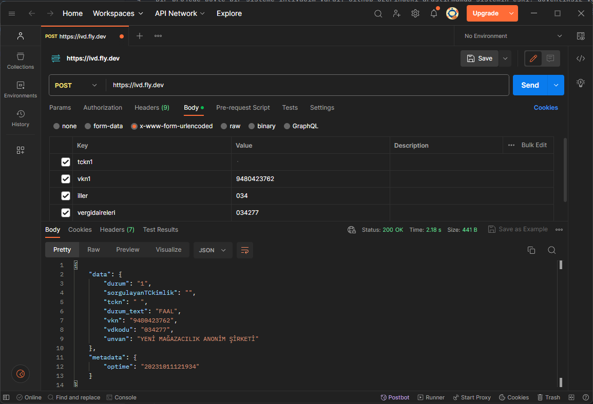

# GIB VKI Doğrulama
Python FastApi ile Gib API Vergi Kimlik No Doğrulama API

Bir projede böyle bir sisteme ihtiyacım vardı. Github üzerindeki araştırmamda sistemin eski, güvenliksiz versiyonu için örnekler buldum. Fakat bu örnekler artış çalışmamaktaydı.
Bu güvenlik sistemi için Captcha resolver kullanmak gerekiyordu. Bu görev için https://huggingface.co/spaces/docparser/Text_Captcha_breaker bu servisi kullandım.

Not: Bazen Captcha resolver yanlış cevap verebiliyor. Bu sebeple güvenlik kodu hatası gelebilir.

DEMO : https://ivd.fly.dev/

Örnek API Call:
